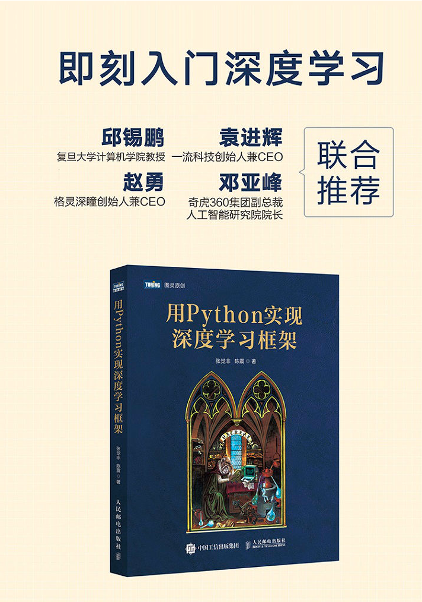

<!--
 * @Author: chenzhen
 * @Date: 2019-07-09 11:36:06
 * @LastEditTime: 2020-10-26 15:47:04
 * @LastEditors: chenzhen
 * @Description:
-->
# MatrixSlow - 用Python实现深度学习框架



### 简介
1984 年，《现代操作系统》（俗称马戏团书）的作者塔嫩鲍姆教授（Andrew S. Tanenbaum）开发了一个教学用的操作系统[Minix](https://www.minix3.org)。受其启发（多大程度未知），Linus Torvalds 创造了Linux系统。这里我们决定效仿前辈，用Python语言从零开始实现一个基于计算图的机器学习/深度学习框架，我们称其MatrixSlow。

实现MatrixSlow的初衷是为了团队内部分享学习。通过把机器学习的理论、原理和工程实践结合起来，在动手“建造”中加深对理论的“理解”。深度学习框架正是一个最好的例子。但是，以TensorFlow为代表的现代深度学习框架的源码对于学习而言已经过于复杂，因此，我们决定用纯Python实现一个简单的深度学习框架MatrixSlow（核心代码2K行左右，只依赖了Numpy）。这个框架基于计算图，支持自动求导和梯度下降优化算法（及变体）。我们用该框架搭建了一些经典模型，包括LR、FM、DNN、CNN、RNN、W&D、DeepFM等）。该框架还包括一些工程上的方案，包括训练器、分布式训练、模型部署和服务等。取MatrixSlow这个谦卑的名字是为了表明它只是一个用于教学的框架，只支持二阶张量（Matrix，但表达力上无损失，详见本书第12章第1节），未考虑计算优化，因此运行起来有些slow。

除了把MatrixSlow的代码开源之外，我们还把设计MatrixSlow时的一些思考和实现细节汇集成书《用Python实现深度学习框架》，由人民邮电出版社（图灵原创）正式出版上架，各大电商平台已可以购买：

- [京东](https://item.jd.com/12994556.html)
- [当当](http://product.dangdang.com/29139156.html)
- [淘宝](https://detail.tmall.com/item.htm?spm=a230r.1.14.110.52abd576UEklUs&id=628890432853&ns=1&abbucket=2)

我们在代码中写了尽量详细的注释，为即便不买书的同学，通过阅读源码亦能理解这个“麻雀虽小五脏俱全”的框架，并从中学习和理解机器学习背后的原理。

著名物理学家，诺贝尔奖得主[Richard Feynman](https://en.wikipedia.org/wiki/Richard_Feynman)办公室的黑板上写了："What I cannot create, I do not understand."，即“我不能建造的，我便无法理解”，MatrixSlow和本书，算是我们对伟大科学先哲思想的一次小小的践行。

### 特性

- 基于计算图，可用于搭建大多数的机器学习模型
- 支持自动微分求导
- 支持随机梯度下降优化算法及其几个重要变种
- 支持常见的模型评估算法
- 支持模型保存和加载
- 支持PS和Ring AllReduce分布式训练
- 支持模型serving

### 依赖
核心代码：
```
- python 3.7及以上
- numpy
```
分布式训练：
```
- protobuf
- grpc
```
示例代码：
```
- pandas
```
### 代码结构
```
.
├── README.md
├── benchmark
├── example
├── matrixslow
└── matrixslow_serving
```
- matrixslow: 核心代码部分，包括计算图、自动微分和优化、模型保存加载、分布式训练的实现
- matrixslow_serving: 通用的模型推理服务，类似tensorflow serving
- example: 按照书中章节分目录的示例，比如ch02介绍了如何用matrixslow实现一个简单的类LR模型,ch11则演示了如何进行分布式训练
